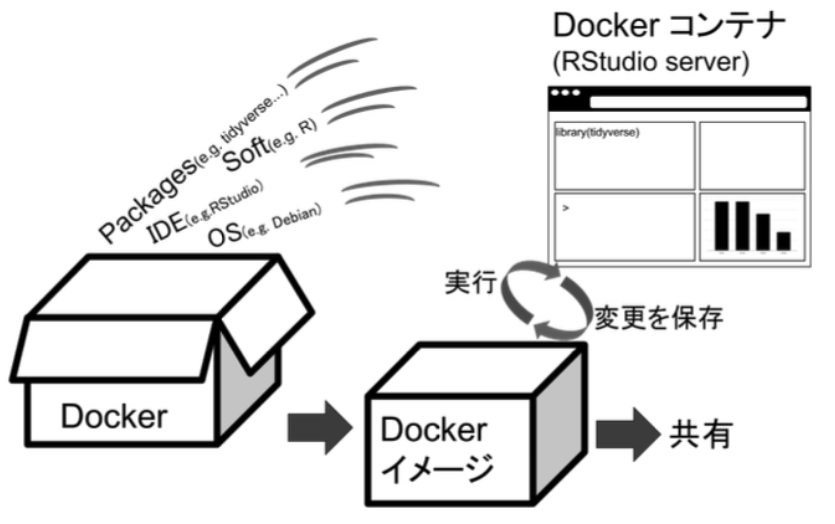

# 事前準備（Dockerとは）

コンピュータが計算するものは正しそうに見えますが，コンピュータのOSの種類，統計解析ソフトのバージョン，Rの場合はパッケージのバージョンによって出力される結果は異なることが多いです。このような統計解析を実行する環境の違いが再現性を低める可能性があります。

解析環境(OSやソフト)が違うとそもそも実行もできないor結果が再現できないことがある。
コードだけでなく，解析環境やバージョン情報も公開する。 Dockerを使ってOSやソフトを含んだコンテナを共有する。

OSに依存せずに，Linuxベースのアプリケーションをコンテナ化する技術。Dockerではコンテナのイメージをつくるが，これを共有すれば，再現可能な環境を共有できる。

Dockerfileを自分で定義すれば，イメージのビルドはできる（つまり，好きなように自作可能）。
ただ，自作はなかなかハードルが高いので，Docker Hub(https://hub.docker.com/ )で公開されているビルド済みのイメージを使うのが良いかと思います。

RStudioと必要なパッケージ(StanやRMarkdownなど）をまとめたdockerを公開しています(rockerベース)
https://hub.docker.com/u/ykunisato

[^1]

https://hub.docker.com/u/rocker

[^1]: Nüst, D., Eddelbuettel, D., Bennett, D., Cannoodt, R., Clark, D., Daróczi, G., Edmondson, M., Fay, C., Hughes, E., Kjeldgaard, L., Lopp, S., Marwick, B., Nolis, H., Nolis, J., Ooi, H., Ram, K., Ross, N., Shepherd, L., Sólymos, P., … Xiao, N. (2020). The Rockerverse: Packages and Applications for Containerisation with R. The R Journal, 12(1), 437.
